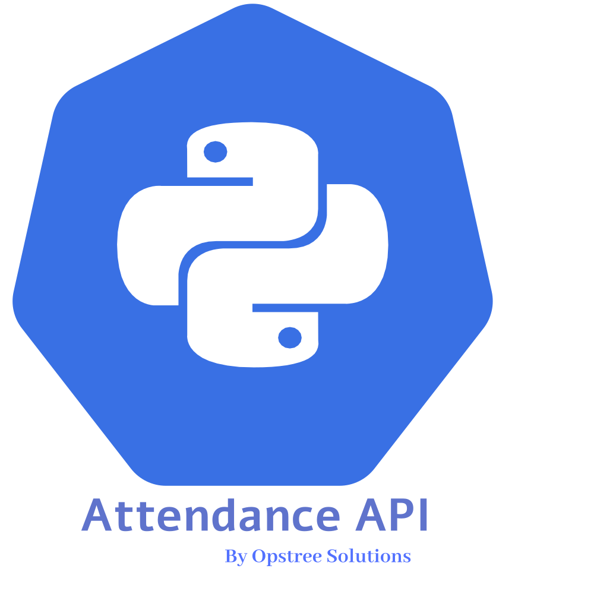
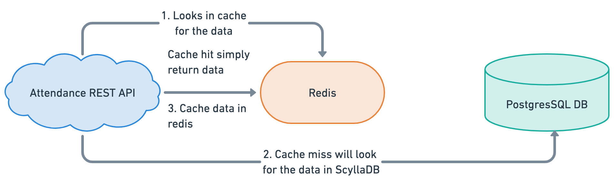

<p align="center">
  
</p>

Attendance REST API is a python based microservice which is responsible for all the attendance related transactions in the [OT-Microservices](https://github.com/OT-MICROSERVICES). This application supports cross-platform, the only thing will be required to run this application is python runtime modules.

Supported features of the application are:-

- Flask based web framework for all REST related transactions
- PostgresSQL as a primary database for storing all the attendance records
- Redis as cache management middleware for storing all API response
- Prometheus and open-telemetry metrics supports for monitoring and observability
- Swagger integration for API documentation of all endpoints

## Pre-Requisites

The attendance api application have some database and package manager dependencies. Some of them are mandatory and some can be option, for example - Redis. To run the application successfully, we need these things configured:

- [PostgresSQL](https://www.postgresql.org/)
- [Redis](https://redis.io/)
- [Poetry](https://python-poetry.org/)
- [Liquibase](https://docs.liquibase.com/)

Poetry will be used as package manager to install specific versions module on dependencies to run the attendance API.

## Architecture



## Application

For building the application, we can use `make` command with our [Makefile](Makefile). But as first and foremost step, we need to install all the dependencies and packages using `poetry`. We can simple use `make` command for it.

```shell
make build
```

For building the docker image artifact of the attendance api, we can invoke another make command.

```shell
make docker-build
```

Also, attendance api contains different test cases and code quality standard related integrations. For checking the quality of the code, we can make use of `pylint`. To summarize and make it easy to run, we can invoke a make command for it. Also, for test cases, we can use `pytest`.

```shell
make fmt
```

```shell
python3 -m pytest
# For generating the code coverage report
 python3 -m pytest --cov=.
```

The test cases are included for following modules and directories:-

- router
- client
- models
- utils

For dev testing, the Swagger UI can be used for sample payload generation and requests. The swagger page will be accessible on http://localhost:8080/apidocs. Before running the application, we have to make sure our mandatory database (PostgresSQL) is up and running. Configuration properties will be configured inside [config.yaml](config.yaml) file. Also, once the property file is defined and configured properly, we need to run migrations to create database, schema etc. The connection details for migration is available in [liquibase.properties](./liquibase.properties).

```shell
make run-migrations
```

Once the database and table is initialized, we can run the application by:

```shell
gunicorn app:app --log-config log.conf -b 0.0.0.0:8080
```

## Endpoints Information

| **Endpoint**                     | **Method** | **Description**                                                                                      |
|----------------------------------|------------|------------------------------------------------------------------------------------------------------|
| /metrics                         | GET        | Application healthcheck and performance metrics are available on this endpoint                       |
| /apidocs                         | GET        | Swagger endpoint for the application API documentation and their data models                         |
| /api/v1/attendance/create        | POST       | Data creation endpoint which accepts certain JSON body to add attendance information in database     |
| /api/v1/attendance/search        | GET        | Endpoint for searching data information using the params in the URL                                  |
| /api/v1/attendance/search/all    | GET        | Endpoint for searching all information across the system                                             |
| /api/v1/attendance/health        | GET        | Endpoint for providing shallow healthcheck information about application health and readiness        |
| /api/v1/attendance/health/detail | GET        | Endpoint for providing detailed health check about dependencies as well like - PostgresSQL and Redis |

## Contact Information

[Opstree Opensource](mailto:opensource@opstree.com)
